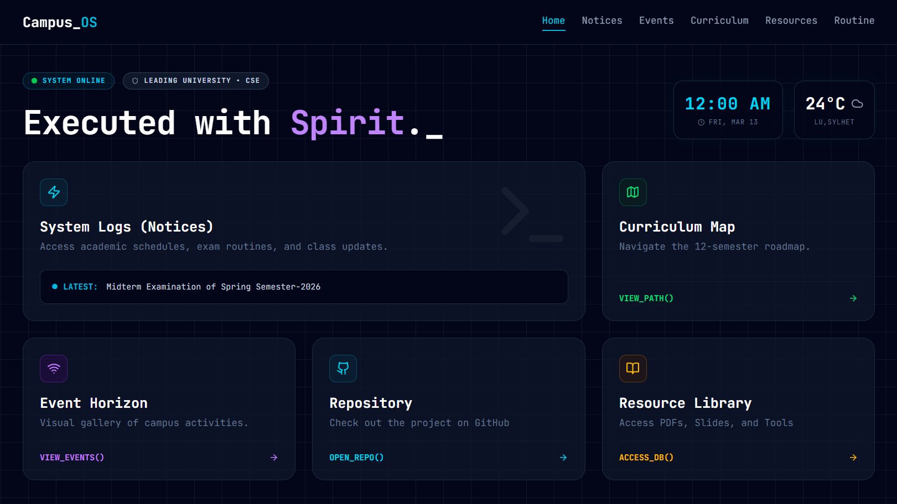
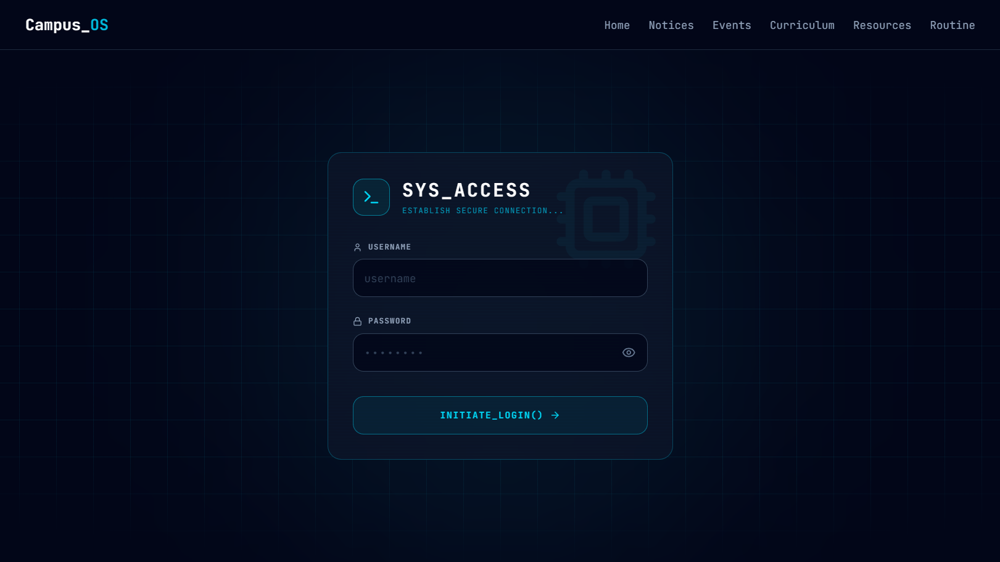
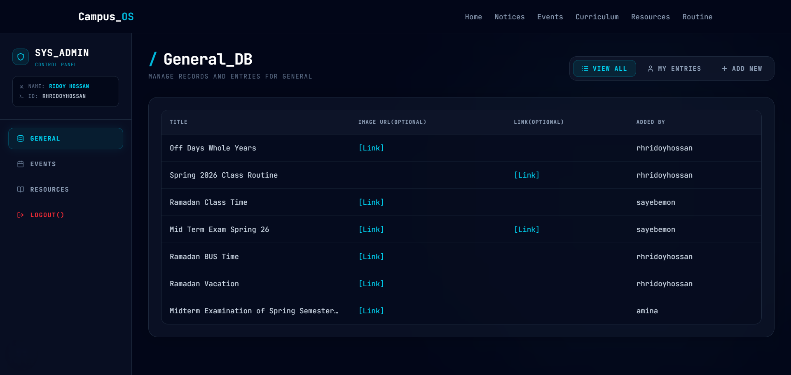
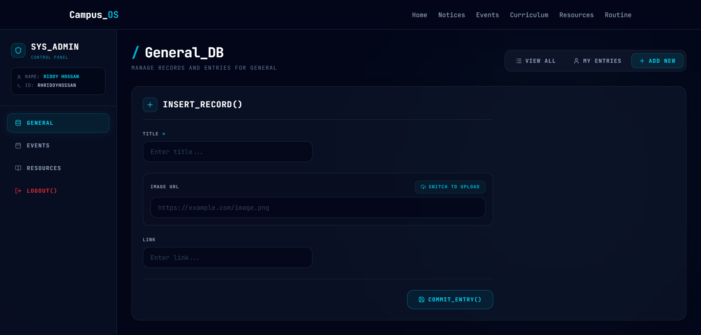
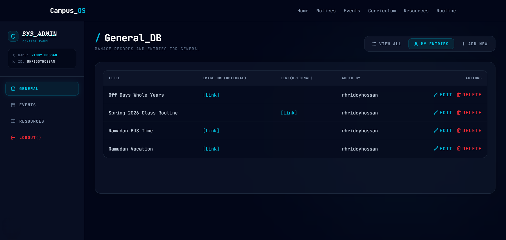
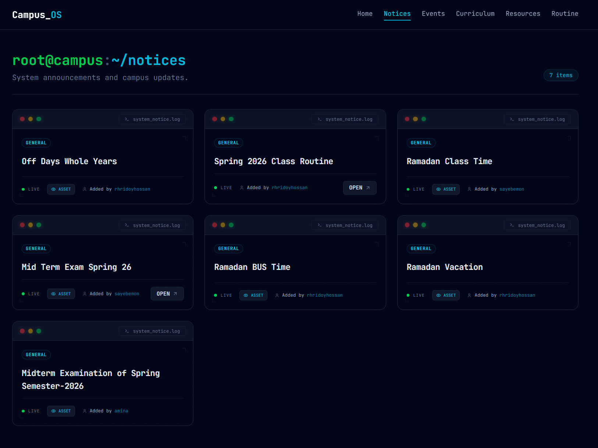
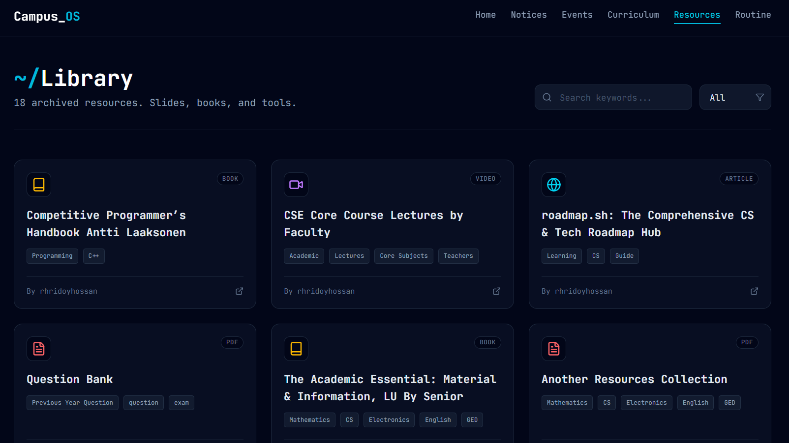
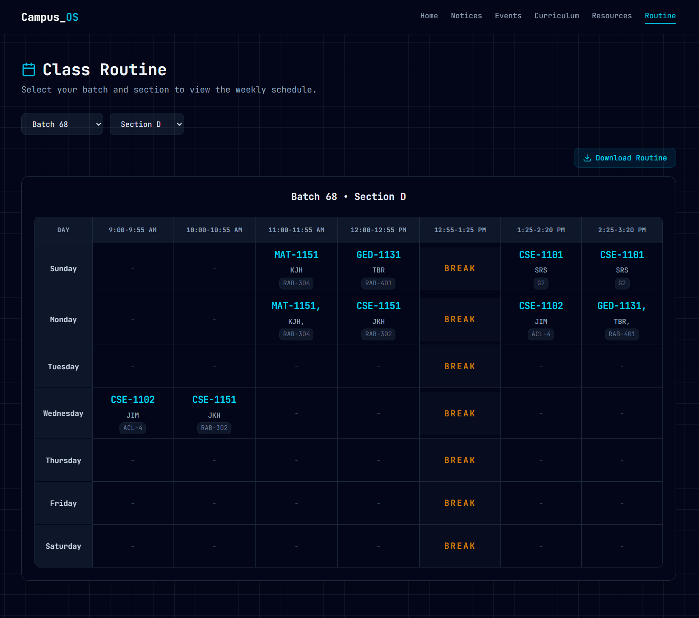
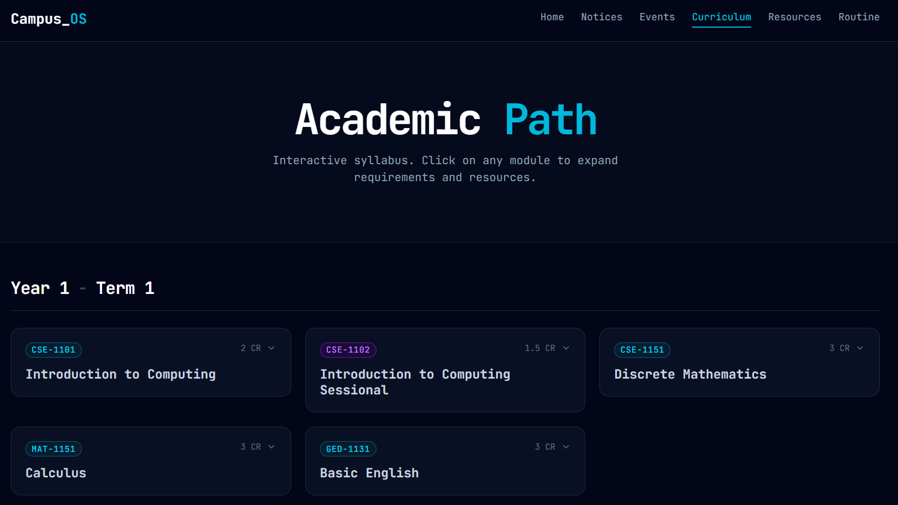

<div align="center">

```
 ██████╗ █████╗ ███╗   ███╗██████╗ ██╗   ██╗███████╗       ██████╗ ███████╗
██╔════╝██╔══██╗████╗ ████║██╔══██╗██║   ██║██╔════╝      ██╔═══██╗██╔════╝
██║     ███████║██╔████╔██║██████╔╝██║   ██║███████╗      ██║   ██║███████╗
██║     ██╔══██║██║╚██╔╝██║██╔═══╝ ██║   ██║╚════██║      ██║   ██║╚════██║
╚██████╗██║  ██║██║ ╚═╝ ██║██║     ╚██████╔╝███████║      ╚██████╔╝███████║
 ╚═════╝╚═╝  ╚═╝╚═╝     ╚═╝╚═╝      ╚═════╝ ╚══════╝       ╚═════╝ ╚══════╝
```

**"Compiled with Dedication. Executed with Spirit."**

[](package.json)
[](https://github.com/rhridoyhossan/lu-cse)
[](https://github.com/rhridoyhossan/lu-cse)
[](https://github.com/rhridoyhossan/lu-cse)

</div>

---

## About

**Campus_OS** is a digital platform for Leading University's CSE.
It helps students find notices, class routines, events, and study resources in one place.

No account needed for students. The admin dashboard, protected by NextAuth credentials, lets authorized users manage all content through a Google Sheets backend.

---

## Features

| Module | Description |
|---|---|
| Home | Live clock, live weather (LU, Sylhet), latest notice ticker, navigation cards |
| Notices | Academic announcements, exam schedules, updates |
| Events | Visual event gallery with registration links, deadlines, and types |
| Curriculum Map | Interactive 12-semester course breakdown with prerequisites and resources |
| Resources | Searchable and filterable library of PDFs, books, videos, and tools |
| Routine | Dynamic class timetable, select your batch and section, download as PNG |
| Admin Dashboard | Protected CRUD panel backed by Google Sheets |

---

## Stack

| Layer | Technology |
|---|---|
| Framework | Next.js 16 (App Router) |
| Language | TypeScript |
| Styling | Tailwind CSS v4 |
| Animation | GSAP + ScrollTrigger + Lenis |
| Auth | NextAuth v5 (Credentials Provider) |
| Database | Google Sheets API |
| Image hosting | ImgBB API |
| UI components | shadcn/ui (Radix UI) |
| Deployment | Vercel |

---

## Data Flow

```
                        Public Pages
                             |
Google Sheets (Main) --> googleSheets.ts (unstable_cache, 60s revalidate)
                             |
                    Server Components (notices, events, resources, home)


                        Admin Dashboard
                             |
Google Sheets (Main) --> adminSheets.ts (no cache, always fresh)
                             |
                    dashboard/page.tsx --> ClientDashboard


                        Routine Page
                             |
Google Sheets (Routine) --> /api/routine (ISR, revalidate: 3600)
                             |
                    RoutineManager --> RoutineTable


                        Admin Mutations
                             |
ClientDashboard --> /api/sheets (POST / PUT / DELETE)
                             |
                    Google Sheets (Main) -- direct write


                        Image Uploads
                             |
ClientDashboard --> /api/upload --> ImgBB API
                             |
                    Returns URL, stored in Sheets


                        Auth + Route Guards
                             |
auth.ts (NextAuth) --> proxy.ts (session check + API firewall)
                             |
                    /login <--> /dashboard redirect logic
```

---

## Setup

### Prerequisites

- Node.js 18 or higher
- A Google Cloud project with the Sheets API enabled
- A Google Service Account with access to your main spreadsheet
- A separate Google Sheets API Key for the routine spreadsheet (public read-only)
- An ImgBB account and API key

### Install

```bash
git clone https://github.com/rhridoyhossan/lu-cse.git
cd lu-cse
npm install
```

### Environment Variables

```bash
cp .env.example .env.local
```

```env
# Google Sheets - Service Account (server-side CRUD and public data)
GOOGLE_SHEET_ID=
GOOGLE_SERVICE_ACCOUNT_EMAIL=
GOOGLE_PRIVATE_KEY=

# Google Sheets - API Key (routine sheet, read-only public access)
GOOGLE_SHEETS_API_KEY=
STUDENT_ROUTINE_SHEET_ID=

# Internal API token
NEXT_PUBLIC_INTERNAL_API_SECRET=

# NextAuth 
AUTH_SECRET=

# ImgBB image hosting
IMGBB_API_KEY=

# Your production domain, used for sitemap, robots.txt, and OpenGraph
PRODUCTION_URL=https://your-domain.com
```

### Sheet Structure

| Tab | Columns |
|---|---|
| General | Title, Image URL (Optional), Link (Optional), Added By |
| Events | Title, Description, Type, Event Date, Register Deadline, Image URL (Optional), Link, Location, Added By |
| Resources | Title, Format, Tags, Link, Added By |
| Users | Username, Password (I am broke developer🫠) |

### Run

```bash
npm run dev      # Development
npm run build    # Production build
npm run start    # Production server
```

---

## Security

API routes use two protection layers:

1. **Session check** -- all `/api/sheets` and `/api/upload` routes require an active NextAuth session. No session returns 401.
2. **Proxy firewall** -- `proxy.ts` validates an `x-internal-token` header and checks the request origin against the allowed domain. This blocks direct external calls to API routes.
3. **Route guards** -- `proxy.ts` redirects unauthenticated users from `/dashboard` to `/login`, and authenticated users from `/login` to `/dashboard`.

---

## Screenshots

### Public Pages

<table>
  <tr>
    <td align="center" width="50%">
      <strong>Home</strong><br/><br/>
      
    </td>
    <td align="center" width="50%">
      <strong>Login</strong><br/><br/>
      
    </td>
  </tr>
</table>

### Admin Dashboard

<table>
  <tr>
    <td align="center" width="50%">
      <strong>Dashboard Overview</strong><br/><br/>
      
    </td>
    <td align="center" width="50%">
      <strong>Add Entry</strong><br/><br/>
      
    </td>
  </tr>
  <tr>
    <td align="center" width="50%">
      <strong>My Entries</strong><br/><br/>
      
    </td>
    <td></td>
  </tr>
</table>

### Campus Information

<table>
  <tr>
    <td align="center" width="50%">
      <strong>Notices</strong><br/><br/>
      
    </td>
    <td align="center" width="50%">
      <strong>Resources</strong><br/><br/>
      
    </td>
  </tr>
  <tr>
    <td align="center" width="50%">
      <strong>Routine</strong><br/><br/>
      
    </td>
    <td align="center" width="50%">
      <strong>Curriculum</strong><br/><br/>
      
    </td>
  </tr>
</table>

---

<div align="center">
  Built with 💙 <strong>Leading University CSE</strong><br/>
</div>